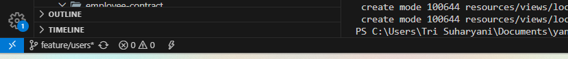
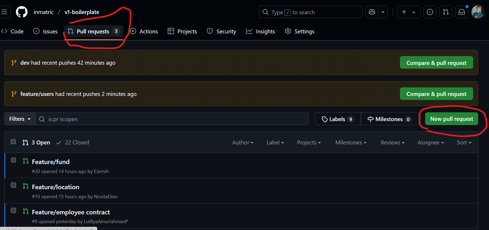
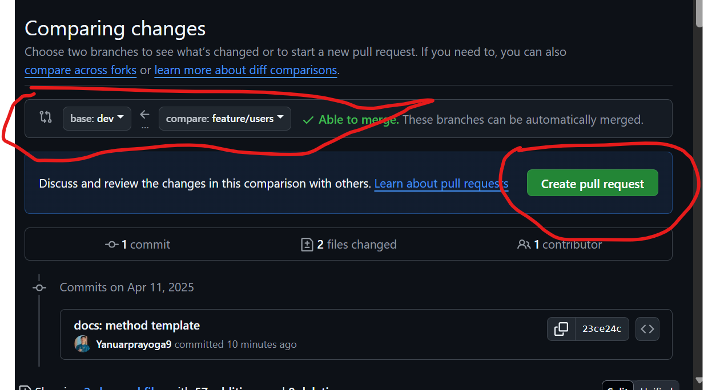
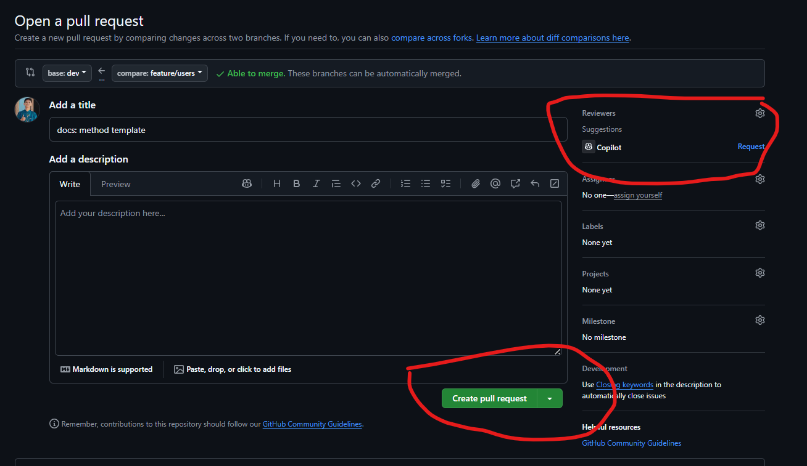
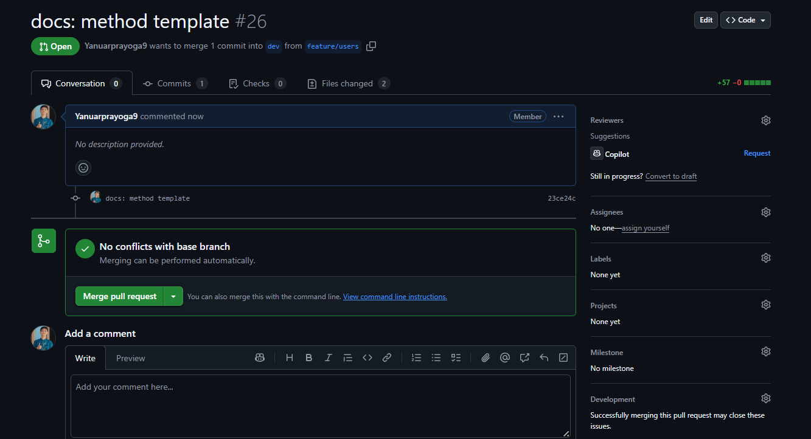

# 🧹 Cara Menggunakan Template Method Sesuai Bagian Masing-Masing  
## 🔧 Implementasi Laravel

### 1. 📦 Membuat Backup Folder  
Untuk mengantisipasi error yang tidak terduga, sebaiknya kita **membuat cadangan** folder project terlebih dahulu.

---

### 2. 📥 Ambil Kode Terbaru  
Pastikan berada di branch `dev` dan tarik update terbaru:

```bash
git checkout dev
git pull origin dev
```

Setelah itu, jalankan migration dan seeder:

```bash
php artisan migrate:fresh
php artisan db:seed
```

---

### 3. 🌿 Buat Branch Baru  
Jika belum memiliki branch untuk fitur yang akan dikerjakan, jalankan perintah berikut:

```bash
git checkout -b feature/users
```
> Pastikan di pojok kiri bawah editor (seperti VSCode) sudah menunjukkan branch yang sesuai.



---

### 4. 🚀 Commit & Push Branch  
Setelah melakukan perubahan, lakukan commit dan push ke remote repository kalian masing-masing:

```bash
git add .
git commit -m "feat: implementasi CRUD user view based"
git push origin feature/users
```

> 💬 Gunakan pesan commit yang **jelas dan deskriptif** sesuai fitur yang dikerjakan.

---

### 5. ⚠️ Penanganan Merge Conflict  
Karena banyak yang mengedit `web.php`, kemungkinan terjadi conflict sangat besar.

Silakan lihat video berikut untuk panduan menyelesaikan konflik:  
📺 [Cara Menyelesaikan Merge Conflict](https://youtu.be/DloR0BOGNU0?si=Xh42y_-Aqj_GAllo)

### 6. Permintaan Penggabungan Pekerjaan dengan master 
buka link github [click](https://github.com/inmatric/v1-boilerplate)

- klik pull request dan new pull request 
### 7. Pilih branch yang akan digabung 
- base <strong>dev</strong> (yang akan dimasukkan) commpare <strong>feature/users</strong> 
- create pull request

- pilih reviewer dahulu agar mengecek pekerjaan kalian 

- create pull request 

### Langkah Selesai Dan minta reviewer untuk mereview pekerjaan 
jangan di merge sendiri
- kalau ada tampilan ini biarkan saja

